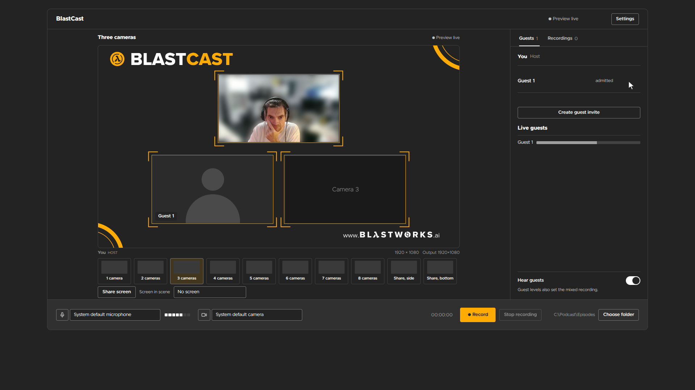
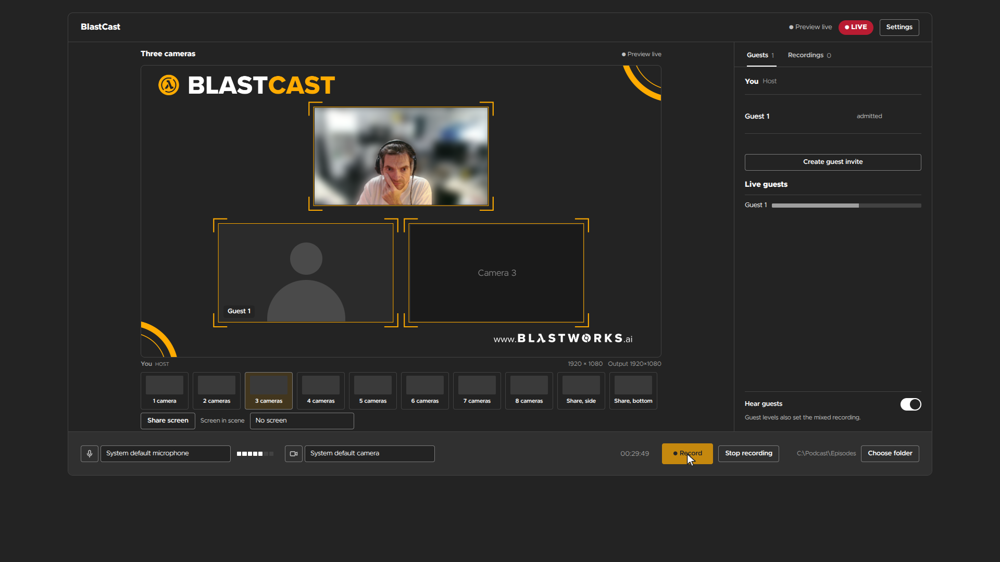

# BlastCast

**Your studio. Your machine. Your recordings.**

BlastCast is a host-owned podcast and video recording studio for conversations
with up to eight people. The host runs the desktop app, guests join from their
browser, and the recording files stay under the host's control.

> **Buy an activation key:** _&lt;where to buy your key&gt;_
>
> Already have a key? Download BlastCast from
> [GitHub Releases](https://github.com/blastworksai/blastcast/releases).

## A local studio built for real conversations

- Record the composed programme in **1080p or 4K**.
- Bring in as many as **eight participants** through private guest links.
- Keep a mixed episode recording alongside separate participant originals.
- Switch between one-to-eight-camera scenes and dedicated screen-share layouts.
- Let guests share their screen, blur their background, or use a local image.
- Save recordings to a folder you choose on the host computer.
- Recover guest originals after a temporary connection loss.
- Activate offline with a signed key—no account sign-in is required by the app.

## How it works

1. **Get BlastCast.** Buy an activation key and download the installer.
2. **Activate once.** Open **Settings → Activation**, paste the complete key,
   and choose **Activate BlastCast**.
3. **Set up your studio.** Choose your microphone, camera, recording folder,
   scene, and 1080p or 4K output.
4. **Invite your guests.** Send the generated private link. Guests use their
   browser and do not need a BlastCast key.
5. **Record.** BlastCast saves the composed episode and tracks the status of
   each participant original on your machine.

Activation keys are signed for offline verification. Official builds contain
the public verification key only; the private signing key is not included in
this repository or in the application package.

## Current build

BlastCast 0.2.3 is available for:

- [Windows x64](https://github.com/blastworksai/blastcast/releases/download/v0.2.3/BlastCast-0.2.3-windows-x64.exe)
- [macOS Apple Silicon](https://github.com/blastworksai/blastcast/releases/download/v0.2.3/BlastCast-0.2.3-macos-arm64.pkg)
- [Linux amd64](https://github.com/blastworksai/blastcast/releases/download/v0.2.3/BlastCast-0.2.3-linux-amd64.deb)

These early builds are not publisher-signed. Windows may show an
unknown-publisher warning, macOS may require you to approve the app in Privacy
& Security, and the Debian package is unsigned. Verify downloads against the
`SHA256SUMS.txt` file attached to the release.

## Source and licence

The source is available for inspection and contribution under the
[BlastCast Source-Available Licence 1.0](LICENSE). This is **not** an open-source
licence: it does not grant permission to redistribute BlastCast, publish
competing builds, or bypass activation. Official builds require a valid
activation key.

Please do not include recordings, invitation links, relay credentials,
activation keys, or other private data in public issues or pull requests.

## Project status

BlastCast is under active development. Publisher signing, notarization, and
additional architectures are still in progress.

---

Built by [BlastworksAI](https://www.blastworks.ai/) — the studio is yours, and so
are the files.
